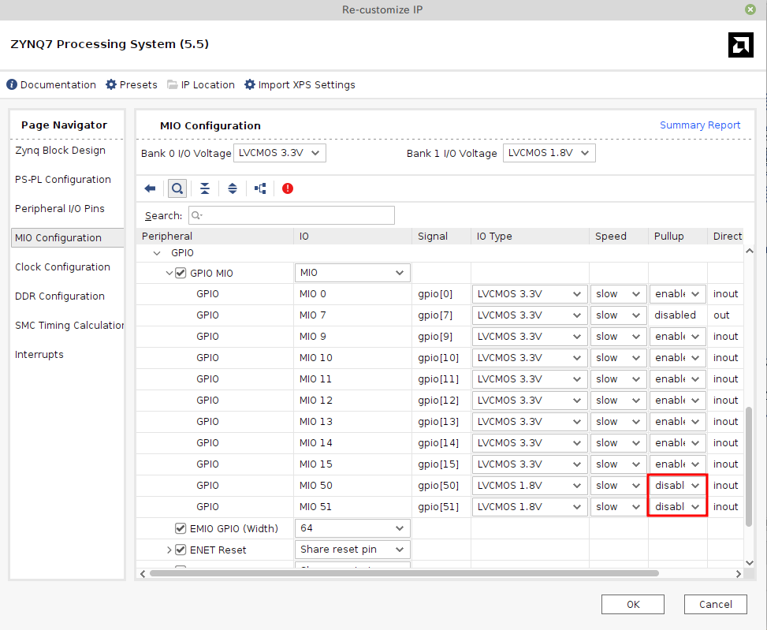

# Zybo Z7-10

[](https://hex.pm/packages/nerves_system_zybo_z7_10)

This is the base Nerves System configuration for the Zybo Z7-10.

| Feature              | Description                                                 |
| -------------------- | ----------------------------------------------------------- |
| CPU                  | 667 MHz dual-core Cortex-A9 (ARMv7)                         |
| Memory               | 1 GB DRAM                                                   |
| Storage              | MicroSD                                                     |
| Linux kernel         | 5.15                                                        |
| IEx terminal         | HDMI and USB keyboard (can be changed to UART)              |
| GPIO, I2C            | Yes - [Elixir Circuits](https://github.com/elixir-circuits) |
| ADC                  | No, in this project's Bitstream                             |
| PWM                  | No, in this project's Bitstream                             |
| UART                 | 1 available - `ttyPS0`                                      |
| Display              | HDMI                                                        |
| Camera               | No, in this project's Bitstream                             |
| Ethernet             | Yes                                                         |
| WiFi                 | No                                                          |
| Bluetooth            | No                                                          |
| Audio                | Yes                                                         |

## Using

The most common way of using this Nerves System is create a project with `mix
nerves.new` and to export `MIX_TARGET=zybo_z7_10`. See the [Getting started
guide](https://hexdocs.pm/nerves/getting-started.html#creating-a-new-nerves-app)
for more information.

If you need custom modifications to this system for your device, clone this
repository and update as described in [Making custom
systems](https://hexdocs.pm/nerves/customizing-systems.html).

## Linux's preempt_rt patches

If you need better real-time performance from the Linux kernel, the `preempt_rt`
patch set may help. Be aware that we do not test with the patches so this may
not work. To enable it, make a custom system using this one as a base and add
the following to the `nerves_defconfig`:

```text
BR2_LINUX_KERNEL_PATCH="http://cdn.kernel.org/pub/linux/kernel/projects/rt/4.19/patch-4.19.25-rt16.patch.xz"
```

Please verify the patch version since these instructions may be out-of-date.

Next, update the Linux configuration to use it. Review the Nerves documentation
for running `make linux-menuconfig` and enable `PREEMPT_RT_FULL`. Alternately,
make the following change to the Linux configuration:

```text
-CONFIG_PREEMPT=y
+CONFIG_PREEMPT_RT_FULL=y
 ```

Build the system and you should now have a preempt_rt kernel.

## Provisioning devices

This system supports storing provisioning information in a small key-value store
outside of any filesystem. Provisioning is an optional step and reasonable
defaults are provided if this is missing.

Provisioning information can be queried using the Nerves.Runtime KV store's
[`Nerves.Runtime.KV.get/1`](https://hexdocs.pm/nerves_runtime/Nerves.Runtime.KV.html#get/1)
function.

Keys used by this system are:

Key                    | Example Value     | Description
:--------------------- | :---------------- | :----------
`nerves_serial_number` | `"12345678"`      | By default, this string is used to create unique hostnames and Erlang node names.

The normal procedure would be to set these keys once in manufacturing or before
deployment and then leave them alone.

For example, to provision a serial number on a running device, run the following
and reboot:

```elixir
iex> cmd("fw_setenv nerves_serial_number 12345678")
```

This system supports setting the serial number offline. To do this, set the
`NERVES_SERIAL_NUMBER` environment variable when burning the firmware. If you're
programming MicroSD cards using `fwup`, the commandline is:

```sh
sudo NERVES_SERIAL_NUMBER=12345678 fwup path_to_firmware.fw
```

Serial numbers are stored on the MicroSD card so if the MicroSD card is
replaced, the serial number will need to be reprogrammed. The numbers are stored
in a U-boot environment block. This is a special region that is separate from
the application partition so reformatting the application partition will not
lose the serial number or any other data stored in this block.

Additional key value pairs can be provisioned by overriding the default
provisioning.conf file location by setting the environment variable
`NERVES_PROVISIONING=/path/to/provisioning.conf`. The default provisioning.conf
will set the `nerves_serial_number`, if you override the location to this file,
you will be responsible for setting this yourself.

## About board/system.bit, system.dtb, zynq_fsbl.elf

### system.dtb

We use system.dtb which is generated by [Zybo-Z7-10-Petalinux-2022-1.bsp](https://github.com/Digilent/Zybo-Z7/releases/tag/10/Petalinux/2022.1-1/Zybo-Z7-10-Petalinux-2022-1.bsp).

### system.bit and zynq_fsbl.elf

We regenerate Bitstream and FSBL by following steps to fix PS's GPIO

```
# refs. https://github.com/Digilent/digilent-vivado-scripts
git clone --recurse-submodules https://github.com/Digilent/Zybo-Z7.git
cd Zybo-Z7/
git checkout 10/Petalinux/2022.1-1
git submodule update --init --recursive
```

1. Start Vivado 2023.2
2. Click Tools -> Run Tcl Script...
3. Select Zybo-Z7/hw/scripts/checkout.tcl and click OK
4. **Fix MIO 50 and 51 pullup, from enable to disable**
5. Generate Bitstream   
   Critical warnings related to dvi2rgb occurs,  
   but it only affects HDMI-in and has no effect on anything else, so we ignore them.
6. Export XSA
7. Create platform for the XSA
8. Build FSBL



### Overwriting Files in the Boot Partition

see. [Nerves Advanced Configuration](https://hexdocs.pm/nerves/advanced-configuration.html#overwriting-files-in-the-boot-partition)

## About UIO

- LD0-3  are binded with /dev/uio0
- SW0-3  are binded with /dev/uio1's GPIO
- BTN0-3 are binded with /dev/uio1's GPIO2
- LD6     is binded with /dev/uio4

see. [UIOSAMPLE.md](UIOSAMPLE.md)

## Loading Bitstream and dtbo at Linux runtime

1. upload Bitstream and dtbo to /tmp by sftp
2. invoke following,

```
iex> cmd "cp /tmp/your_bitstream.bit.bit /lib/firmware"
iex> cmd "mkdir /configfs/device-tree/overlays/your_overlay"
iex> cmd "cat /tmp/your_overlay.dtbo > /configfs/device-tree/overlays/your_overlay/dtbo"
```
